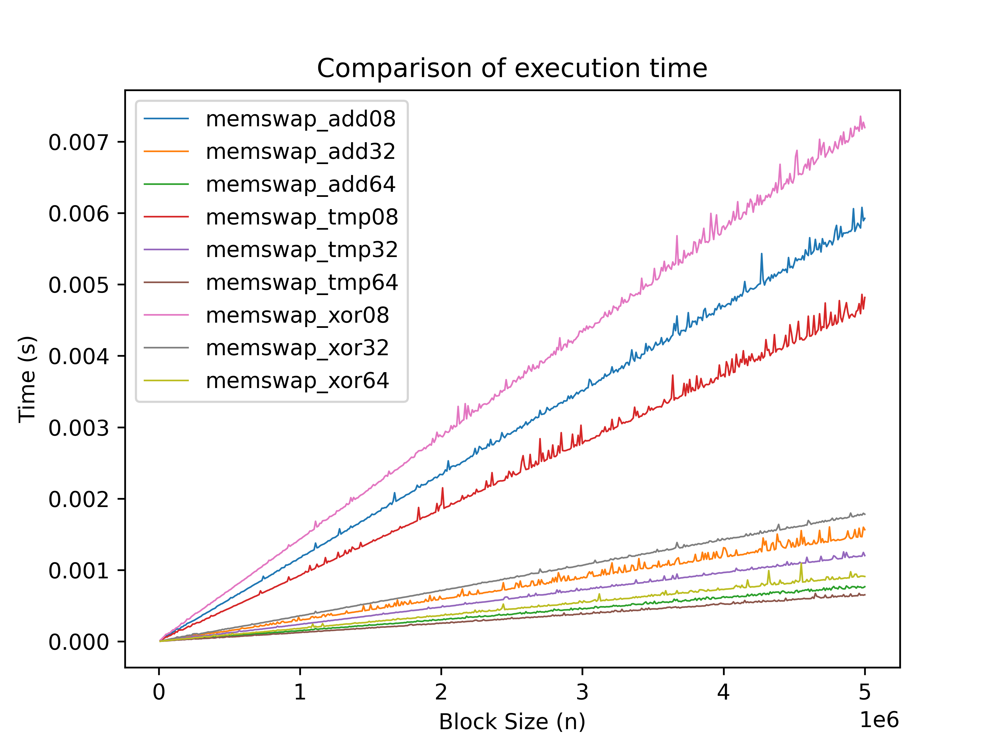

# Memswap
A function for swapping memory sections

Basically everything is done, but the README is still in development

Graph for large tests (from 10000 to 10000000 bytes in increments of 1000, 5 identical tests each)

Graph for large tests, elements are often repeated (from 10000 to 10000000 bytes in increments of 1000, 5 identical tests, byte values within 10-20)

A graph for small tests (from 100 to 10000 bytes in increments of 1, 20 identical tests, i.e. 200,000 tests). I tried, but I couldn't make the graph look beautiful.

