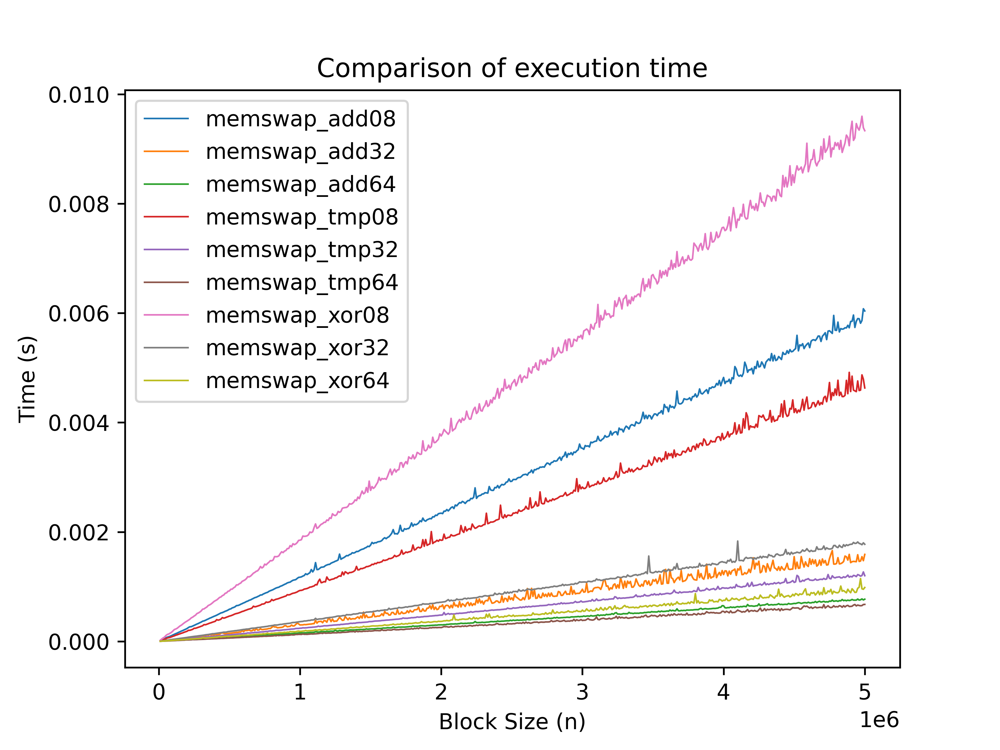
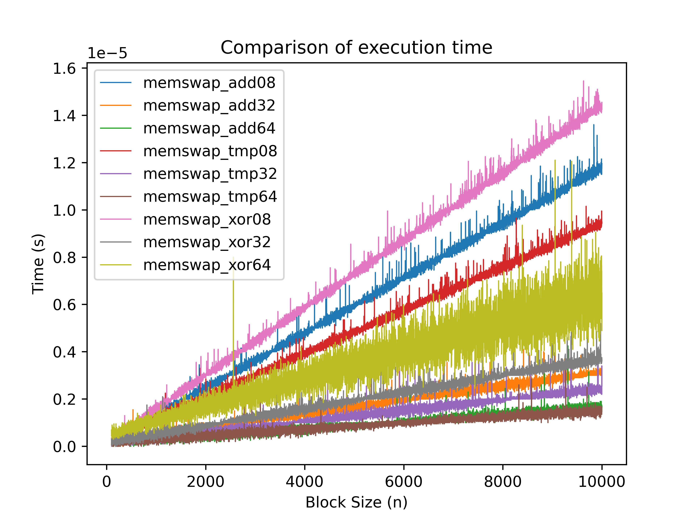
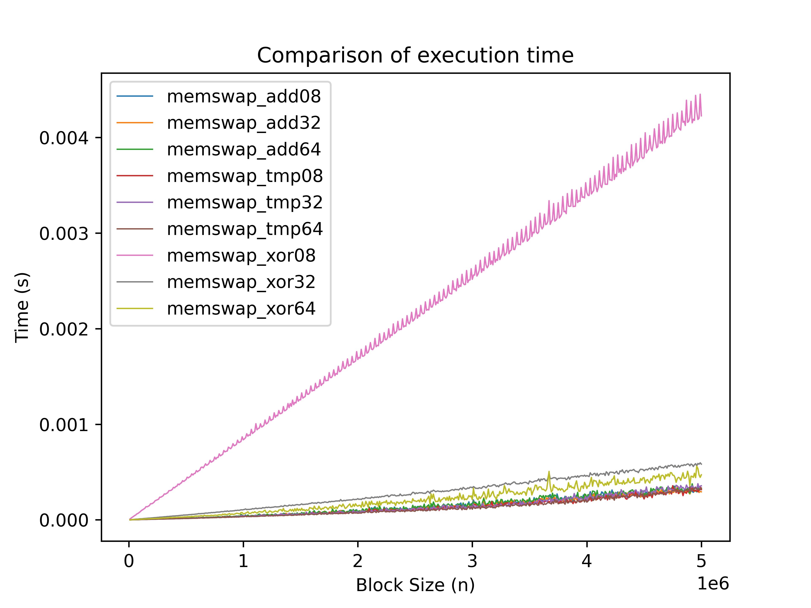
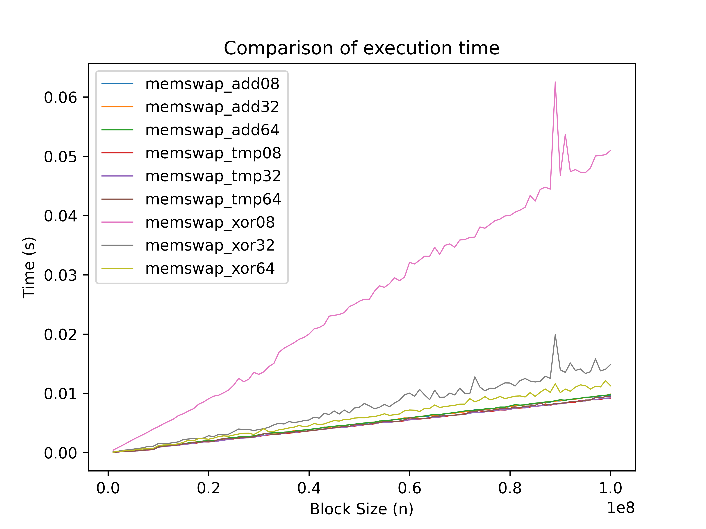
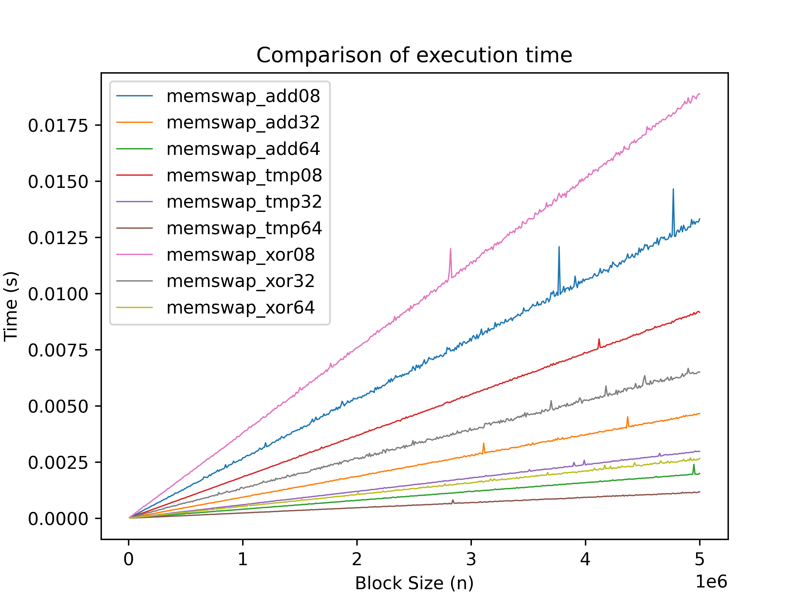

# Memswap

## Introduction
<div align="justify">
    I came across xor-swap and started using it regularly. It looked beautiful and felt like it was working faster. However, at some point, I began to doubt how well it functioned and decided to do some specific and honest testing.
</div>

<div align="justify">
    In these tests, we will look at several implementations of swap: tmp, xor, add. More information about the algorithms themselves can be found here https://en.wikipedia.org/wiki/XOR_swap_algorithm.
</div>

### Important notes
<div align="justify">
    <ul>
        <li>Processor: 13th Gen Intel(R) Core(TM) i9-13900KF </li>
        <li>Compiler : gcc (Debian 12.2.0-14) 12.2.0</li>
    </ul>
</div>

### Compilation Notes
<div align="justify">
    <ul>
        <li>To compile, you will need make, gcc, python3.</li>
        <li>Python 3 is needed for plotting.</li>
        <li>The moisture you choose in the Makefile, there will be improvements at this point in the near future.</li>
        <li>The footage of the graph generator can be found in /src/graphs_generator/Footage.py. If you want to create graphs that you prefer, you can modify it. Just remember that some comments cannot be edited, so be careful.</li>
    </ul>
    The compilation looks like this:
</div>

```bash
make
```
<div align="justify">
    The test generator is compiled separately, I will also fix this point in the future.
</div>

## Tests
<div align="justify">
    We will test using different compilation flags in order to get a better understanding of the situation. The testing process is straightforward - the program reads the input from a file and measures how long it takes for the algorithm to run on this data (at the same time, we also check whether the algorithm is producing the correct output).
</div>

### A note on algorithms
<div align="justify">
    Three implementations are given for each algorithm. Generally speaking, this only means the size of the pointer that is used for swap, i.e. uint64_t, uint32_t, uint8_t. (In all cases, except uint8_t, it is necessary to separately reach the remainder of the division).
</div>

### Description of the tests
<ul>
    <li>Graph for large tests: from 10000 to 10000000 bytes in increments of 1000, 5 identical tests each;</li>
    <li>Graph for large tests, elements are often repeated: from 10000 to 10000000 bytes in increments of 1000, 5 identical tests, byte values within 10-20;</li>
    <li>Graph for small tests: from 100 to 10000 bytes in increments of 1, 20 identical tests, i.e. 200,000 tests;</li>
    <li>Graph for very large tests: 1000000 to 100000000 bytes in increments of 1000000, 5 identical tests, totaling 50GB</li>
</ul>

### Without compilation flags
<div align="center">
    <h4>Graph for large tests</h4>
    <div style="text-align:center"></div>
    <h4>Graph for large tests, elements are often repeated</h4>
    <div style="text-align:center"></div>
    <h4>Graph for small tests</h4>
    <div style="text-align:center"></div>
    <h4>Graph for very large tests</h4>
    <div style="text-align:center"></div>
</div>

### With the flag -O3
<div align="center">
    <h4>Graph for large tests</h4>
    <div style="text-align:center"></div>
    <h4>Graph for large tests, elements are often repeated</h4>
    <div style="text-align:center"></div>
    <h4>Graph for small tests</h4>
    <div style="text-align:center"></div>
    <h4>Graph for very large tests</h4>
    <div style="text-align:center"></div>
</div>

### With numerous debagging flags (without -O3)

The numerous compilation flags mean the following:
```make
-D _DEBUG -ggdb3 -Wall -Wextra  -Waggressive-loop-optimizations -Wmissing-declarations -Wcast-align -Wcast-qual -Wchar-subscripts -Wconversion -Wempty-body -Wfloat-equal -Wformat-nonliteral -Wformat-security -Wformat-signedness -Wformat=2 -Winline -Wlogical-op -Wopenmp-simd -Wpacked -Wpointer-arith -Winit-self -Wredundant-decls -Wshadow -Wsign-conversion -Wstrict-overflow=2 -Wsuggest-attribute=noreturn -Wsuggest-final-methods -Wsuggest-final-types -Wswitch-default -Wswitch-enum -Wsync-nand -Wundef -Wunreachable-code -Wunused -Wvariadic-macros -Wno-missing-field-initializers -Wno-narrowing -Wno-varargs -Wstack-protector -fcheck-new -fstack-protector -fstrict-overflow -flto-odr-type-merging -fno-omit-frame-pointer -Wlarger-than=8192 -Wstack-usage=8192 -pie -fPIE -Werror=vla -fsanitize=address,alignment,bool,bounds,enum,float-cast-overflow,float-divide-by-zero,integer-divide-by-zero,leak,nonnull-attribute,null,object-size,return,returns-nonnull-attribute,shift,signed-integer-overflow,undefined,unreachable,vla-bound,vptr
```

<div align="center">
    <h4>Graph for large tests</h4>
    <div style="text-align:center"></div>
    <h4>Graph for large tests, elements are often repeated</h4>
    <div style="text-align:center"></div>
    <h4>Graph for small tests</h4>
    <div style="text-align:center"></div>
    <h4>Graph for very large tests</h4>
    <div style="text-align:center"></div>
</div>

### With numerous debagging flags (with -O3)

The numerous compilation flags mean the following:
```make
-O3 -D _DEBUG -ggdb3 -Wall -Wextra  -Waggressive-loop-optimizations -Wmissing-declarations -Wcast-align -Wcast-qual -Wchar-subscripts -Wconversion -Wempty-body -Wfloat-equal -Wformat-nonliteral -Wformat-security -Wformat-signedness -Wformat=2 -Winline -Wlogical-op -Wopenmp-simd -Wpacked -Wpointer-arith -Winit-self -Wredundant-decls -Wshadow -Wsign-conversion -Wstrict-overflow=2 -Wsuggest-attribute=noreturn -Wsuggest-final-methods -Wsuggest-final-types -Wswitch-default -Wswitch-enum -Wsync-nand -Wundef -Wunreachable-code -Wunused -Wvariadic-macros -Wno-missing-field-initializers -Wno-narrowing -Wno-varargs -Wstack-protector -fcheck-new -fstack-protector -fstrict-overflow -flto-odr-type-merging -fno-omit-frame-pointer -Wlarger-than=8192 -Wstack-usage=8192 -pie -fPIE -Werror=vla -fsanitize=address,alignment,bool,bounds,enum,float-cast-overflow,float-divide-by-zero,integer-divide-by-zero,leak,nonnull-attribute,null,object-size,return,returns-nonnull-attribute,shift,signed-integer-overflow,undefined,unreachable,vla-bound,vptr
```

<div align="center">
    <h4>Graph for large tests</h4>
    <div style="text-align:center"></div>
    <h4>Graph for large tests, elements are often repeated</h4>
    <div style="text-align:center"></div>
    <h4>Graph for small tests</h4>
    <div style="text-align:center"></div>
    <h4>Graph for very large tests</h4>
    <div style="text-align:center"></div>
</div>

# Conclusion from the graphs 
<div align="justify">
    It is clear that <strong>memswap_tmp64</strong> always wins. Therefore, it is better to always give preference to the <strong>memswap_tmp64</strong> algorithm.
</div>

## Analysis